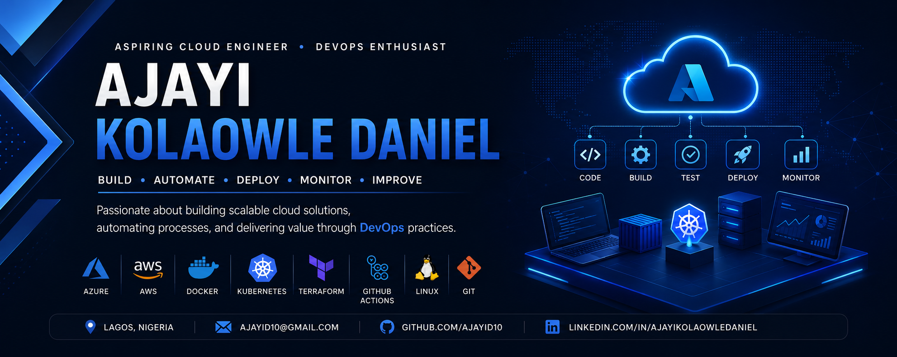

<!-- ========================================================= -->
<!--                 AJAYI KOLAOWLE DANIEL                     -->
<!--                    GitHub Profile                         -->
<!-- ========================================================= -->

  

<h1 align="center">Hi 👋, I'm Ajayi Kolaowle Daniel</h1>

  <strong>Aspiring Cloud Engineer • DevOps Enthusiast</strong>

  <em>Building • Automating • Deploying • Learning</em>

  Welcome to my GitHub profile! I'm passionate about cloud technologies,
  DevOps practices, automation, and building real-world projects.
  I enjoy learning new technologies and continuously improving my technical skills.

  

  

  

---

## 👨‍💻 About Me

I'm an **Aspiring Cloud Engineer and DevOps Enthusiast** focused on developing practical skills in cloud infrastructure, automation, containerization, CI/CD, Linux administration, and Infrastructure as Code.

I enjoy turning ideas into practical projects while learning how to build, deploy, automate, monitor, and maintain reliable applications and cloud environments.

- 🔭 Currently working on **Cloud & DevOps projects**
- 🌱 Currently learning **Microsoft Azure, GitHub Actions, Kubernetes, Terraform, Linux, Docker and CI/CD**
- 🤝 Looking to collaborate on **Open Source and Cloud/DevOps projects**
- 💬 Ask me about **Azure, Cloud, Linux, Docker, Git, CI/CD or DevOps**
- 🎯 Goal: Become a **Cloud & DevOps Engineer**
- 📫 Email: **Ajayid10@gmail.com**
- 📍 Based in **Lagos, Nigeria**

---

## ☁️ Cloud & DevOps Focus

  

  <strong>
    Cloud Infrastructure • CI/CD • Infrastructure as Code • Containers • Kubernetes • Linux • Automation
  </strong>

---

## 🛠️ Tech Stack

### ☁️ Cloud & DevOps

  

### 💻 Programming & Development

  

### 🔧 Tools & Platforms

  

---

## 🚀 Featured Projects

### 📚 Digital Skills

A modern web application showcasing digital skills, cloud computing, and DevOps concepts.

The project demonstrates:

- Responsive web development
- Git version control
- GitHub collaboration
- Web development fundamentals
- Digital technology concepts

**Repository:**

👉 [Digital Skills](https://github.com/ajayid10/Digitalskills)

---

### ☁️ Azure DevOps Lab

A hands-on Cloud and DevOps learning project covering:

- Microsoft Azure
- Linux administration
- Git & GitHub
- GitHub Actions
- CI/CD pipelines
- Terraform
- Infrastructure as Code
- Docker
- Kubernetes
- Cloud infrastructure

**Repository:** 🚧 Coming Soon

---

### 🐧 Linux System Administration Lab

A practical Linux administration project covering:

- Linux file management
- Users and groups
- File permissions
- Shell commands
- Shell scripting
- Process management
- Networking
- SSH
- Package management
- System troubleshooting

**Repository:** 🚧 Coming Soon

---

## 🏆 Microsoft Applied Skills

I have completed the following Microsoft Applied Skills credentials:

| Certification | Organization | Status |
|---|---|---|
| Implement Security Through a Pipeline Using Azure DevOps | Microsoft | ✅ Completed |
| Deploy Cloud-Native Apps Using Azure Container Apps | Microsoft | ✅ Completed |
| Administer Active Directory Domain Services | Microsoft | ✅ Completed |
| Get Started with Identities and Access Using Microsoft Entra | Microsoft | ✅ Completed |
| Deploy and Configure Azure Monitor | Microsoft | ✅ Completed |
| Secure Storage for Azure Files and Azure Blob Storage | Microsoft | ✅ Completed |
| Get Started with Cloud Security and Monitoring Tasks | Microsoft | ✅ Completed |
| Get Started with Azure Management Tasks | Microsoft | ✅ Completed |
| Configure Secure Access to Workloads Using Azure Networking | Microsoft | ✅ Completed |

---

---

---

## 🔥 GitHub Streak

  

---

## 📈 Contribution Activity

  

---

## 🎯 Cloud & DevOps Roadmap

- 🚀 Build 10+ real-world Cloud & DevOps projects
- ☁️ Deepen my Microsoft Azure skills
- 🔄 Build and improve CI/CD pipelines
- 🐳 Improve Docker and containerization skills
- ☸️ Learn and master Kubernetes
- 🏗️ Improve Infrastructure as Code skills with Terraform
- 🐧 Strengthen Linux system administration skills
- 🔐 Improve Cloud Security and Identity Management
- 🤝 Contribute to Open Source projects
- 🏆 Earn additional Cloud certifications
- 💼 Land a Cloud Engineering / DevOps Engineering role

---

## 🤝 Let's Connect

I'm always open to learning, collaborating, and connecting with people interested in:

**Cloud Computing • DevOps • Azure • AWS • Kubernetes • Terraform • Linux • Docker • CI/CD • Open Source**

---

  <strong>⭐ Thank you for visiting my profile! ⭐</strong>

  <em>Build. Automate. Deploy. Learn. Repeat. 🚀</em>

